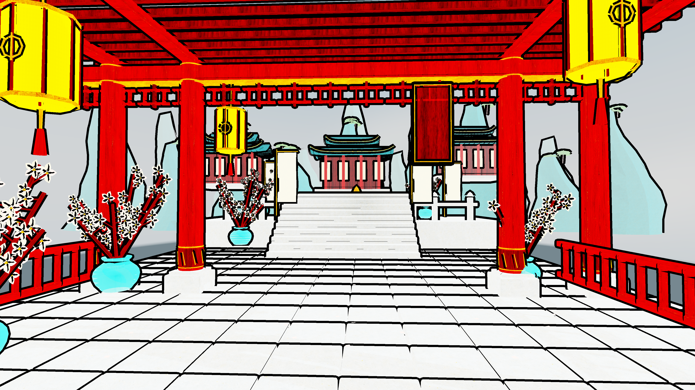
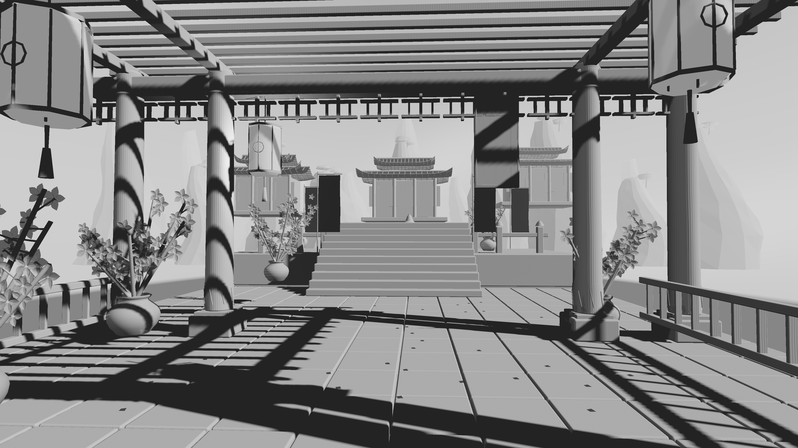
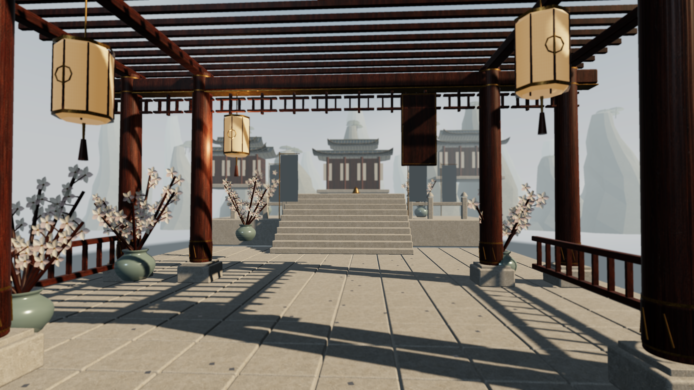
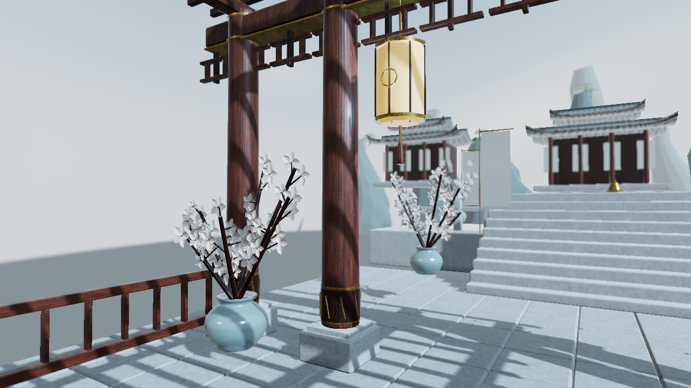
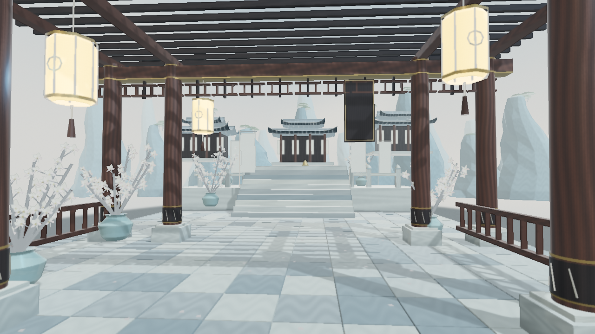
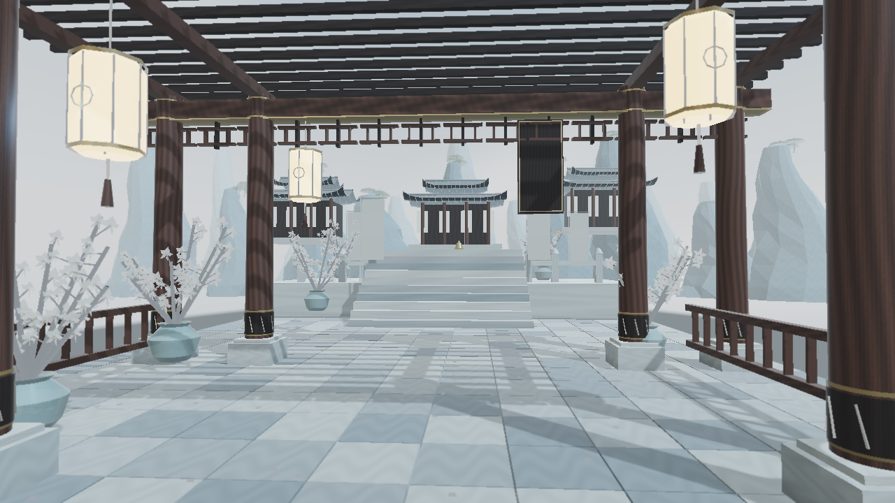

# S89 — Mist Courtyard

## Current main: all surface presets at 4K

`main.motionloom` cycles through every current surface preset, then a diagnostic
grey model, in 16 seconds:
`filmic_physical_v1`, `physical`, `stylized`, `toon`, `clay`, `cel` and
`ink_wash_soft_v1`, with one discrete cut every 2 seconds. The final 14–16 second
segment uses only the minimum clay material override plus zero saturation: no
outline, grading, tone, lighting or lens preset. The original camera push ends
at 8 seconds and holds its final position for the remaining 8 seconds. CEL uses
two hard bands, maximum-width black geometry outlines and maximum rim strength.







[Previous filmic-only 4K video](filmic-main-4k.mp4). The previews below are historical.
`main2.motionloom` retains its previous close study for comparison.

The bokeh kernel uses a 41-sample golden-angle disk with signed depth difference
and aspect scaling. The old foreground-spreading algorithm is not used by this
preset. Material factors use glTF linear values, authored light colors use
correct RGB, and the shadow map affects its owning light only. Environment
filtering, shadow filtering, fog and rasterization remain MotionLoom-native.

## Current main: cinematic physical, 4K

`main.motionloom` restores the original wide view from inside the sect hall,
looking through the timber pavilion toward the central stair. It uses the detailed
assets and a 3840×2160 Graph. The
`courtyard_cinematic` style uses existing physical shading, explicitly disables
outlines, reduces specular and contact-shadow emphasis, and adds restrained warm
highlights, cool shadows and distance fog. This explores a grounded Chinese
fantasy mood; it does not reproduce Black Myth: Wukong's rendering technology or
asset fidelity. No global preset shader was changed.


[Watch the current 4K wide hall video](main-4k.mp4). The previous close material
study is preserved unchanged as [`main2.motionloom`](main2.motionloom), with its
[4K video](cinematic-4k.mp4). Both scripts share the same RenderStyle, lights,
textures, detail meshes and 4K Graph; only camera framing, focus and motion differ.
The videos are H.264, 3840×2160, 240 frames,
approximately 8 seconds. Opening and closing frames were inspected. Main's
targeted authoring/schema check is clean, and native live preview successfully
ran at Full quality with a 3840×2160 render target. This is not a WASM benchmark.

The older ink and physical comparison scripts below remain 720p intentionally.
They are historical studies, not the current main. The original 1536 shadow map
is unchanged: a 4K Graph does not imply a 4K shadow map or more mesh detail.
The new 4K still was rendered and visually inspected. Three warm debug offscreen
samples averaged 67.4 ms, too limited for a benchmark and not a 30 fps guarantee.

## Latest study: physical detail first, then light ink

Open `physical-detail.motionloom` for the new material/lighting baseline and
`ink-detail.motionloom` for its matching-camera ink comparison. The earlier
previews remain available for comparison; main now selects the cinematic version above.



[Physical video](physical-detail.mp4) · [Light ink image](ink-detail.png) ·
[Light ink video](ink-detail.mp4)

The detail meshes add real rounded edges to timber and stone, paving joints,
tile-row lips, curved flower petals, smoother vase normals and corrected branch
normals. Wood, limestone and bronze now have generated base-colour maps plus
procedural normal and roughness/metallic maps. See [material provenance and
prompts](assets/pbr/README.md). This is not a generated background: all previews
are rendered from 3D geometry by MotionLoom.

Lighting uses a warm side sun, cooler environment fill, the existing soft shadow
map, AO and contact shadows. Physical shading is kept as the reference; the ink
variant adds only a 0.02 tint and 0.08 universal tone blend. The preset itself
still has fixed ink processing, so those controls are not an overall effect mix.

Rebuild with `python3 build.py --detail`; the generated albedo PNGs must remain
in `assets/pbr`. Use the render commands below with `physical-detail.motionloom`
or `ink-detail.motionloom` and matching output filenames. Detail meshes contain
211,318 courtyard triangles and 8,289 background triangles. They preserve the
original lower-detail assets instead of replacing them.

This is a focused material study, not photoreal parity with the supplied reference.
Architecture, foliage and mountains remain simplified; the sky is LDR, there is
no new GI or scene-reflection system, and generated albedos are not measured PBR
scans. Browser/WASM performance has not been measured for these larger assets.

Both GPU videos exported successfully: H.264, 1280×720, 240 frames, approximately
8 seconds (container duration 7.967 seconds). Opening stills and final video
frames were visually inspected. The native optimized physical live preview ran
at Full quality and advanced through the 30 fps timeline; early CPU submission
averages were 3.3–5.3 ms, not total GPU or browser frame times. The 12-frame warm
offscreen samples averaged 13.1 ms physical and 12.0 ms ink; these small samples
are not evidence that ink is faster. Loading the larger assets still took several
seconds on the cold native path.

## Previous version: pastel coloured-ink WGSL preset

The previous main selected `ink_wash_soft_v1`, tuned to retain the reference's
warm timber, pale golden lamps and blue-grey stone. Ink changes luminance instead
of replacing the material palette. The dedicated preset renders soft ink densities,
depth-aware washes, one-sided contours and paper grain. Universal tint,
saturation, exposure, contrast and tone colours run after the preset. It requires
the updated MotionLoom build; older engines reject the new syntax.



[Watch the pastel ink preview](pastel-preview.mp4). The previous grey-green
version remains at [ink-preview.mp4](ink-preview.mp4). The original `preview.png` and
`preview.mp4` below are retained as the physical baseline. The scene geometry
and camera are unchanged. This is a procedural NPR approximation of ink on paper,
not a physical simulation of wet pigment.

Render the current version with the commands below, changing the output names
to `pastel-preview.png` and `pastel-preview.mp4` to preserve both older versions.

Current universal tuning: tint `#FFF3E3`, tintStrength `0.035`, saturation `1.1`,
exposure `1.04`, contrast `1.025`, shadowColor `#3A424B`, highlightColor `#FFF3DF`,
toneStrength `0.18`. The earlier `0.65` tone blend and `0.75` saturation had
overridden too much of the material palette. The WGSL now retains chroma, reduces
banding strength, deposits less contour ink, and fades distant outlines faster.
No geometry, lights, textures, camera or DSL syntax changed in this tuning pass.
The GPU regression test now also checks material chroma retention against physical
shading, and all six modes still pass the shared-control pixel tests.

Validation: all 19 native RenderStyle tests passed, including GPU checks that
neutral controls preserve pixels and tint/saturation/exposure/tone colours work
for physical, stylized, toon, clay, cel and ink. S89 authoring analysis is clean.
The ink video is H.264, 1280×720, 240 frames / 8 seconds; its opening and closing
frames were inspected. WASM target compilation passed, but this does not replace
browser runtime testing or a browser FPS measurement.
The rebuilt native live preview also ran at Full quality / 1280×720, advancing
the 30 fps camera timeline. Early CPU render/submission averages were about
2.8–4.1 ms; those figures exclude presentation and are not total GPU frame times.

## Original physical baseline

An 8-second, silent, 1280×720 / 30 fps render-style study using the existing MotionLoom renderer. The camera slowly advances through a timber pavilion toward a pale stone courtyard. Warm silk lanterns, ivory blossoms, aged brass and layered blue-grey mountains interpret the supplied reference's palette and depth. There are no characters or text overlays.



[Watch the rendered preview](preview.mp4). Open `main.motionloom` to edit the lighting and style. The three assets use local relative paths; keep the `assets` directory beside the script. They need no network downloads. A browser host must resolve those paths against the showcase folder or import the complete folder.

## What to adjust

| Existing setting | Current value | Visual purpose |
| --- | --- | --- |
| SurfaceStyle shading | physical | Preserve lighting and material volume |
| SurfaceStyle roughnessBias / specular | 0.06 / 0.7 | Restrain glossy highlights |
| LightingStyle ambientIntensity | 0.78 | Retain detail under the pavilion |
| PostStyle saturation / contrast | 0.83 / 0.96 | Pale colour and softer tonal separation |
| PostStyle exposure / whiteBalance | 1.15 / 5800 | Bright daylight with a mild warm bias; exposure is a multiplier |
| PostStyle bloomIntensity | 0.045 | Slight lantern highlight softness |
| DirectionalLight sun | warm, intensity 3.0 | Warm directional lighting and one shadow map |
| EnvironmentLight | original LDR sky, intensity 0.9 | Cool fill and broad environment reflections |
| AtmosphereFog start / end | 22 / 125 | Separate the courtyard from distant mountains |

The shadow map remains the renderer's existing 1536 setting. No new rendering API, DSL syntax or shader was introduced. The roof, pots, flowers and mountains are original procedural meshes, not a generated background image. `build.py` recreates both GLBs and the small procedural sky with Python's standard library. The two GLBs contain approximately 72,363 triangles combined and embed their wood, stone and silk maps.

## Rebuild and verify

From this directory:

```sh
python3 build.py
```

From the sibling `anica` repository:

```sh
cargo run -p motionloom --example authoring_report -- ../motionloom-example/showcase/s-000089/main.motionloom native-webgpu
cargo run -p motionloom --example render_file_frame_gpu -- ../motionloom-example/showcase/s-000089/main.motionloom ../motionloom-example/showcase/s-000089/preview.png 0 12
cargo run -p motionloom --example render_file_video -- ../motionloom-example/showcase/s-000089/main.motionloom ../motionloom-example/showcase/s-000089/preview.mp4 gpu
cargo run --release -p motionloom --example wgpu_live_preview -- ../motionloom-example/showcase/s-000089/main.motionloom --stats
```

Native GPU authoring validation reports zero errors and warnings. The delivered H.264 preview contains 240 frames and lasts exactly 8 seconds. Start and end frames were visually reviewed. A local debug-build sample of 12 warm texture renders averaged 9.7 ms; this is a small native measurement, not a browser or end-to-end FPS guarantee.

The optimized native live preview also launched successfully at Full quality / 1280×720 and advanced through the camera animation. Its early average CPU render/submission time was approximately 3.7–4.6 ms. This excludes presentation scheduling and is not a claim about complete GPU frame time or WASM performance.

## Interpretation and limitations

This first pass explores restrained physical shading and atmospheric depth. It is visibly simplified geometry and does not match the reference's photoreal ornament, vegetation, clouds or wet-floor reflections. It has no ink diffusion shader, GI, planar reflections, or temporal accumulation. Floor highlights use the existing environment/specular path; they are not reflections of the pavilion itself.

Material factors are calibrated to the current MotionLoom shader's display-space factor treatment. Their appearance in an independent glTF renderer may differ. The reference image is used only as visual direction and is not redistributed. All bundled geometry and texture pixels are generated by this showcase's script.

The example catalogue was regenerated after registering tags already used by existing showcases; that also refreshes stale S81/S86/S87 metadata and indexes the existing S88.
